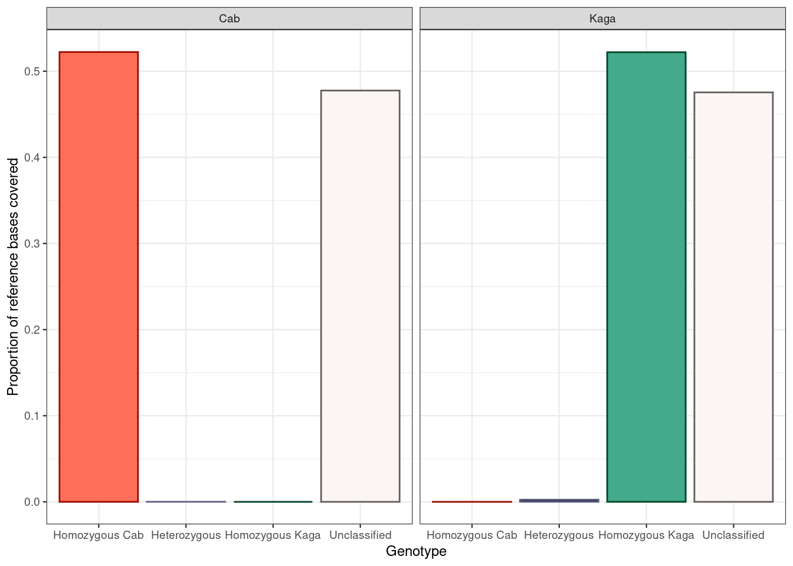

# Homozygosity of F0 Cab and Kaga


## Read in total medaka genome count


```r
# Get chromosome lengths
med_chr_lens = read.table(here::here("data",
                                     "Oryzias_latipes.ASM223467v1.dna.toplevel.fa_chr_counts.txt"),
                          col.names = c("chr", "end"))
# Add start
med_chr_lens$start = 1
# Reorder
med_chr_lens = med_chr_lens %>% 
  dplyr::select(chr, start, end) %>% 
  # remove MT
  dplyr::filter(chr != "MT")

# Total HdrR sequence length
total_hdrr_bases = sum(med_chr_lens$end)
```

Make custom chromosome scaffold


```r
##Create custom genome 
med_genome = regioneR::toGRanges(med_chr_lens)
```


## Read in data


```r
in_dir = "/nfs/research/birney/users/ian/somites/recombination_blocks"

in_files = list.files(in_dir, pattern = "20210803_hmm_output_F0", full.names = T)

# Read into list
ck_list = purrr::map(in_files, function(FILE){
  out = readr::read_tsv(FILE,
                        col_types = "ciiidii")
})
# Set names as bin length
names(ck_list) = basename(in_files) %>% 
  stringr::str_split("_", simplify = T) %>% 
  subset(select = 6) %>% 
  stringr::str_remove(".txt")
# Reorder
ck_list = ck_list[order(as.numeric(names(ck_list)))]

counter = 0
ck_list = purrr::map(ck_list, function(data){
  counter <<- counter + 1
  # set bin length
  bin_length = as.numeric(names(ck_list)[counter])
  # add bin start and end coordinates
  df = data %>% 
    dplyr::mutate(LANE = sample %>%
                    stringr::str_split("/", simplify = T) %>% 
                    subset(select = 10),
                  BIN_LENGTH = bin_length,
                  BIN_START = (bin - 1) * bin_length + 1,
                  BIN_END = bin * bin_length,
                  BIN_LENGTH_KB = BIN_LENGTH / 1e3,
                  READS_PER_BIN = mat + pat)
  return(df)
})

# Recode `ck_list$state` so that 0,1,2 corresponds to HOM_REF, HET, HOM_ALT 
ck_list = purrr::map(ck_list, function(df){
  df = df %>% 
    dplyr::mutate(state = dplyr::recode(state,
                                        `0` = 2,
                                        `1` = 1,
                                        `2` = 0))
})
```

### Get total number of bases covered by each state


```r
# Take 5kb DF
df = ck_list$`5000`

# Set states to loop over
states = 0:2
names(states) = states

# Run loop over each LANE

base_cov_df = df %>% 
  split(., f = .$LANE) %>% 
  purrr::map(., function(LANE){
    # convert to ranges object
    lane_ranges = GenomicRanges::makeGRangesFromDataFrame(LANE,
                                                          keep.extra.columns = T,
                                                          ignore.strand = T,
                                                          seqnames.field = "chr", 
                                                          start.field = "BIN_START",
                                                          end.field = "BIN_END")
    # get total bases covered by each state
    purrr::map_dfr(states, function(STATE){
      lane_ranges[lane_ranges$state == STATE] %>% 
        # merge contiguous ranges
        GenomicRanges::reduce(.) %>% 
        # get width of ranges
        width(.) %>% 
        # get total bases covered
        sum(.) %>% 
        # coerce into data frame
        data.frame("BASES_COVERED" = .)
      }, .id = "STATE") %>% 
        # add FREQ column
        dplyr::mutate(FREQ = BASES_COVERED / total_hdrr_bases) %>% 
        # add UNCLASSIFIED row
        tibble::add_row(STATE = "UNCLASSIFIED", 
                        BASES_COVERED = total_hdrr_bases - sum(.$BASES_COVERED),
                        FREQ = (total_hdrr_bases - sum(.$BASES_COVERED)) / total_hdrr_bases)
    }
  ) %>% 
  dplyr::bind_rows(.id = "LANE")
```

Plot


```r
# Plot
ck_prop_plot = base_cov_df %>% 
  dplyr::mutate(STATE = factor(STATE, levels = c(0,1,2, "UNCLASSIFIED")),
                STATE_RECODE = dplyr::recode(STATE,
                                             `0` = "HOM REF (HdrR)",
                                             `1` = "HET",
                                             `2` = "HOM ALT",
                                             "UNCLASSIFIED" = "Unclassified")) %>% 
  # plot
  ggplot(aes(STATE_RECODE, FREQ, colour = STATE, fill = STATE)) +
    geom_col() +
    facet_grid(cols = vars(LANE)) +
    theme_bw() +
    scale_colour_manual(values = pal_ck_1_lines) +
    scale_fill_manual(values = pal_ck_1) +
    guides(colour = "none", fill = "none") +
    xlab("Genotype") +
    ylab("Proportion of reference bases covered")

ck_prop_plot
```


```r

# Interactive version
ggplotly(ck_prop_plot)
```

```{=html}
<div id="htmlwidget-9ec1619252cec5a9a399" style="width:100%;height:480px;" class="plotly html-widget"></div>
<script type="application/json" data-for="htmlwidget-9ec1619252cec5a9a399">{"x":{"data":[{"orientation":"v","width":0.9,"base":0,"x":[1],"y":[0.396401902537317],"text":"STATE_RECODE: HOM REF (HdrR)<br />FREQ: 0.396401903<br />STATE: 0<br />STATE: 0","type":"bar","marker":{"autocolorscale":false,"color":"rgba(255,111,89,1)","line":{"width":1.88976377952756,"color":"rgba(155,11,0,1)"}},"name":"0","legendgroup":"0","showlegend":true,"xaxis":"x","yaxis":"y","hoverinfo":"text","frame":null},{"orientation":"v","width":0.9,"base":0,"x":[1],"y":[0.00491798562818014],"text":"STATE_RECODE: HOM REF (HdrR)<br />FREQ: 0.004917986<br />STATE: 0<br />STATE: 0","type":"bar","marker":{"autocolorscale":false,"color":"rgba(255,111,89,1)","line":{"width":1.88976377952756,"color":"rgba(155,11,0,1)"}},"name":"0","legendgroup":"0","showlegend":false,"xaxis":"x2","yaxis":"y","hoverinfo":"text","frame":null},{"orientation":"v","width":0.9,"base":0,"x":[2],"y":[0.521497201791511],"text":"STATE_RECODE: HET<br />FREQ: 0.521497202<br />STATE: 1<br />STATE: 1","type":"bar","marker":{"autocolorscale":false,"color":"rgba(0,0,34,1)","line":{"width":1.88976377952756,"color":"rgba(100,100,134,1)"}},"name":"1","legendgroup":"1","showlegend":true,"xaxis":"x","yaxis":"y","hoverinfo":"text","frame":null},{"orientation":"v","width":0.9,"base":0,"x":[2],"y":[0.575731275990362],"text":"STATE_RECODE: HET<br />FREQ: 0.575731276<br />STATE: 1<br />STATE: 1","type":"bar","marker":{"autocolorscale":false,"color":"rgba(0,0,34,1)","line":{"width":1.88976377952756,"color":"rgba(100,100,134,1)"}},"name":"1","legendgroup":"1","showlegend":false,"xaxis":"x2","yaxis":"y","hoverinfo":"text","frame":null},{"orientation":"v","width":0.9,"base":0,"x":[3],"y":[0.00649146856462004],"text":"STATE_RECODE: HOM ALT<br />FREQ: 0.006491469<br />STATE: 2<br />STATE: 2","type":"bar","marker":{"autocolorscale":false,"color":"rgba(67,170,139,1)","line":{"width":1.88976377952756,"color":"rgba(0,70,39,1)"}},"name":"2","legendgroup":"2","showlegend":true,"xaxis":"x","yaxis":"y","hoverinfo":"text","frame":null},{"orientation":"v","width":0.9,"base":0,"x":[3],"y":[0.388520864626231],"text":"STATE_RECODE: HOM ALT<br />FREQ: 0.388520865<br />STATE: 2<br />STATE: 2","type":"bar","marker":{"autocolorscale":false,"color":"rgba(67,170,139,1)","line":{"width":1.88976377952756,"color":"rgba(0,70,39,1)"}},"name":"2","legendgroup":"2","showlegend":false,"xaxis":"x2","yaxis":"y","hoverinfo":"text","frame":null},{"orientation":"v","width":0.9,"base":0,"x":[4],"y":[0.0756094271065516],"text":"STATE_RECODE: Unclassified<br />FREQ: 0.075609427<br />STATE: UNCLASSIFIED<br />STATE: UNCLASSIFIED","type":"bar","marker":{"autocolorscale":false,"color":"rgba(251,245,243,1)","line":{"width":1.88976377952756,"color":"rgba(101,95,93,1)"}},"name":"UNCLASSIFIED","legendgroup":"UNCLASSIFIED","showlegend":true,"xaxis":"x","yaxis":"y","hoverinfo":"text","frame":null},{"orientation":"v","width":0.9,"base":0,"x":[4],"y":[0.0308298737552272],"text":"STATE_RECODE: Unclassified<br />FREQ: 0.030829874<br />STATE: UNCLASSIFIED<br />STATE: UNCLASSIFIED","type":"bar","marker":{"autocolorscale":false,"color":"rgba(251,245,243,1)","line":{"width":1.88976377952756,"color":"rgba(101,95,93,1)"}},"name":"UNCLASSIFIED","legendgroup":"UNCLASSIFIED","showlegend":false,"xaxis":"x2","yaxis":"y","hoverinfo":"text","frame":null}],"layout":{"margin":{"t":37.9178082191781,"r":18.9954337899543,"b":40.1826484018265,"l":43.1050228310502},"plot_bgcolor":"rgba(255,255,255,1)","paper_bgcolor":"rgba(255,255,255,1)","font":{"color":"rgba(0,0,0,1)","family":"","size":14.6118721461187},"xaxis":{"domain":[0,0.495923026744945],"automargin":true,"type":"linear","autorange":false,"range":[0.4,4.6],"tickmode":"array","ticktext":["HOM REF (HdrR)","HET","HOM ALT","Unclassified"],"tickvals":[1,2,3,4],"categoryorder":"array","categoryarray":["HOM REF (HdrR)","HET","HOM ALT","Unclassified"],"nticks":null,"ticks":"outside","tickcolor":"rgba(51,51,51,1)","ticklen":3.65296803652968,"tickwidth":0.66417600664176,"showticklabels":true,"tickfont":{"color":"rgba(77,77,77,1)","family":"","size":11.689497716895},"tickangle":-0,"showline":false,"linecolor":null,"linewidth":0,"showgrid":true,"gridcolor":"rgba(235,235,235,1)","gridwidth":0.66417600664176,"zeroline":false,"anchor":"y","title":"","hoverformat":".2f"},"annotations":[{"text":"Genotype","x":0.5,"y":-0.0176940639269406,"showarrow":false,"ax":0,"ay":0,"font":{"color":"rgba(0,0,0,1)","family":"","size":14.6118721461187},"xref":"paper","yref":"paper","textangle":-0,"xanchor":"center","yanchor":"top","annotationType":"axis"},{"text":"Proportion of reference bases covered","x":-0.0159001956947162,"y":0.5,"showarrow":false,"ax":0,"ay":0,"font":{"color":"rgba(0,0,0,1)","family":"","size":14.6118721461187},"xref":"paper","yref":"paper","textangle":-90,"xanchor":"right","yanchor":"center","annotationType":"axis"},{"text":"Cab","x":0.247961513372472,"y":1,"showarrow":false,"ax":0,"ay":0,"font":{"color":"rgba(26,26,26,1)","family":"","size":11.689497716895},"xref":"paper","yref":"paper","textangle":-0,"xanchor":"center","yanchor":"bottom"},{"text":"Kaga","x":0.752038486627528,"y":1,"showarrow":false,"ax":0,"ay":0,"font":{"color":"rgba(26,26,26,1)","family":"","size":11.689497716895},"xref":"paper","yref":"paper","textangle":-0,"xanchor":"center","yanchor":"bottom"}],"yaxis":{"domain":[0,1],"automargin":true,"type":"linear","autorange":false,"range":[-0.0287865637995181,0.60451783978988],"tickmode":"array","ticktext":["0.0","0.2","0.4","0.6"],"tickvals":[0,0.2,0.4,0.6],"categoryorder":"array","categoryarray":["0.0","0.2","0.4","0.6"],"nticks":null,"ticks":"outside","tickcolor":"rgba(51,51,51,1)","ticklen":3.65296803652968,"tickwidth":0.66417600664176,"showticklabels":true,"tickfont":{"color":"rgba(77,77,77,1)","family":"","size":11.689497716895},"tickangle":-0,"showline":false,"linecolor":null,"linewidth":0,"showgrid":true,"gridcolor":"rgba(235,235,235,1)","gridwidth":0.66417600664176,"zeroline":false,"anchor":"x","title":"","hoverformat":".2f"},"shapes":[{"type":"rect","fillcolor":"transparent","line":{"color":"rgba(51,51,51,1)","width":0.66417600664176,"linetype":"solid"},"yref":"paper","xref":"paper","x0":0,"x1":0.495923026744945,"y0":0,"y1":1},{"type":"rect","fillcolor":"rgba(217,217,217,1)","line":{"color":"rgba(51,51,51,1)","width":0.66417600664176,"linetype":"solid"},"yref":"paper","xref":"paper","x0":0,"x1":0.495923026744945,"y0":0,"y1":23.37899543379,"yanchor":1,"ysizemode":"pixel"},{"type":"rect","fillcolor":"transparent","line":{"color":"rgba(51,51,51,1)","width":0.66417600664176,"linetype":"solid"},"yref":"paper","xref":"paper","x0":0.504076973255055,"x1":1,"y0":0,"y1":1},{"type":"rect","fillcolor":"rgba(217,217,217,1)","line":{"color":"rgba(51,51,51,1)","width":0.66417600664176,"linetype":"solid"},"yref":"paper","xref":"paper","x0":0.504076973255055,"x1":1,"y0":0,"y1":23.37899543379,"yanchor":1,"ysizemode":"pixel"}],"xaxis2":{"type":"linear","autorange":false,"range":[0.4,4.6],"tickmode":"array","ticktext":["HOM REF (HdrR)","HET","HOM ALT","Unclassified"],"tickvals":[1,2,3,4],"categoryorder":"array","categoryarray":["HOM REF (HdrR)","HET","HOM ALT","Unclassified"],"nticks":null,"ticks":"outside","tickcolor":"rgba(51,51,51,1)","ticklen":3.65296803652968,"tickwidth":0.66417600664176,"showticklabels":true,"tickfont":{"color":"rgba(77,77,77,1)","family":"","size":11.689497716895},"tickangle":-0,"showline":false,"linecolor":null,"linewidth":0,"showgrid":true,"domain":[0.504076973255055,1],"gridcolor":"rgba(235,235,235,1)","gridwidth":0.66417600664176,"zeroline":false,"anchor":"y","title":"","hoverformat":".2f"},"showlegend":true,"legend":{"bgcolor":"rgba(255,255,255,1)","bordercolor":"transparent","borderwidth":1.88976377952756,"font":{"color":"rgba(0,0,0,1)","family":"","size":11.689497716895},"y":1},"hovermode":"closest","barmode":"relative"},"config":{"doubleClick":"reset","showSendToCloud":false},"source":"A","attrs":{"2d054a3b1e0b51":{"x":{},"y":{},"colour":{},"fill":{},"type":"bar"}},"cur_data":"2d054a3b1e0b51","visdat":{"2d054a3b1e0b51":["function (y) ","x"]},"highlight":{"on":"plotly_click","persistent":false,"dynamic":false,"selectize":false,"opacityDim":0.2,"selected":{"opacity":1},"debounce":0},"shinyEvents":["plotly_hover","plotly_click","plotly_selected","plotly_relayout","plotly_brushed","plotly_brushing","plotly_clickannotation","plotly_doubleclick","plotly_deselect","plotly_afterplot","plotly_sunburstclick"],"base_url":"https://plot.ly"},"evals":[],"jsHooks":[]}</script>
```

## Karyoplot


```r
bb_list_ck = purrr::map(ck_list, function(df){
  # loop over different bin lengths
  block_bounds_list = df %>% 
    # loop over LANE
    split(., f = .$LANE) %>% 
    purrr::map(., function(LANE){
      # loop over CHR
      LANE %>% 
        split(., f = .$chr) %>% 
        purrr::map(., function(CHR){
          # Get lengths of each contiguous state
          cont_len = rle(CHR$state)
          
          # Get cumulative sum of those lengths
          cum_blocks = cumsum(cont_len$lengths)
          
          # Get rows that correspond to block changes
          block_bounds = CHR[cum_blocks, ] %>% 
            # Add end of previous black
            dplyr::mutate(END_PREV = dplyr::lag(BIN_END)) %>% 
            # Replace the NA in the first row with `1`
            dplyr::mutate(END_PREV = tidyr::replace_na(END_PREV, 1)) %>% 
            # Add colour
            dplyr::mutate(COLOUR = dplyr::recode(state,
                                                 !!!pal_ck_1[-which(names(pal_ck_1) == "UNCLASSIFIED")])) 
          
        }) %>% 
            dplyr::bind_rows()
      
  })
})
```

Extract y cutoff points for each y


```r
lc_list_ck = purrr::map(bb_list_ck, function(block_bounds_list){
  lane_cutoffs = cut(0:1, breaks = length(block_bounds_list)) %>% 
    levels(.) %>% 
    data.frame(lower = as.numeric( sub("\\((.+),.*", "\\1", .) ),
               upper = as.numeric( sub("[^,]*,([^]]*)\\]", "\\1", .) )) %>% 
    dplyr::arrange(dplyr::desc(lower))
  return(lane_cutoffs)
})
```

Plot Karyoplots


```r
counter_A = 0
purrr::map(bb_list_ck, function(block_bounds_list){
  counter_A <<- counter_A + 1
  # set file name
  file_name = paste("20210803_ck_karyoplot_", names(bb_list)[counter_A], ".png", sep = "")
  file_out = here::here("docs/plots", file_name)
  
  # Get lane cutoffs
  lane_cutoffs = lc_list_ck[[counter_A]]
  
  png(file=file_out,
      width=13000,
      height=3000,
      units = "px",
      res = 300)
  
  # Plot ideogram
  kp = karyoploteR::plotKaryotype(med_genome, plot.type = 5)
  # Add data background
  #karyoploteR::kpDataBackground(kp, r0=0, r1 = 1, color = "white")
  
  # Add rectangles in loop
  counter_B = 0
  purrr::map(block_bounds_list, function(LANE){
    # Add to counter_B
    counter_B <<- counter_B + 1
    # Add rectangles
    karyoploteR::kpRect(kp,
                        chr = LANE$chr,
                        x0 = LANE$END_PREV,
                        x1 = LANE$BIN_END,
                        y0 = lane_cutoffs[counter_B, ] %>% 
                          dplyr::pull(lower),
                        y1 = lane_cutoffs[counter_B, ] %>% 
                          dplyr::pull(upper),
                        col = LANE$COLOUR,
                        border = NA)
    # Add axis label
    karyoploteR::kpAddLabels(kp, labels = unique(LANE$LANE),
                             r0 = lane_cutoffs[counter_B, ] %>% 
                               dplyr::pull(lower),
                             r1 = lane_cutoffs[counter_B, ] %>% 
                               dplyr::pull(upper),
                             cex = 0.5)
  })
  
  
  dev.off()  
})
```


```r
knitr::include_graphics(here::here("book/plots/20210803_ck_karyoplot_5000.png"))
```

<div class="figure">

<p class="caption">(\#fig:unnamed-chunk-10)Bin length: 5 kb</p>
</div>

## 20211110 update

*Changes*:

* Used homozgygous-divergent Cab-Kaga sites instead of all sites in F0 VCF
* Filtered out reads that overlapped repeat regions

### Read in data


```r
in_dir = "/nfs/research/birney/users/ian/somites/recombination_blocks/F0/no_repeat_reads"

in_files = list.files(in_dir, full.names = T)

# Read into list
ck_list = purrr::map(in_files, function(FILE){
  out = readr::read_tsv(FILE,
                        col_types = "ciiidii")
})
# Set names as bin length
names(ck_list) = basename(in_files) %>%
  stringr::str_remove(".txt")
# Reorder
ck_list = ck_list[order(as.numeric(names(ck_list)))]

counter = 0
ck_list = purrr::map(ck_list, function(data){
  counter <<- counter + 1
  # set bin length
  bin_length = as.numeric(names(ck_list)[counter])
  # add bin start and end coordinates
  df = data %>% 
    dplyr::mutate(LANE = sample %>%
                    basename() %>% 
                    stringr::str_remove(".txt"),
                  BIN_LENGTH = bin_length,
                  BIN_START = (bin - 1) * bin_length + 1,
                  BIN_END = bin * bin_length,
                  BIN_LENGTH_KB = BIN_LENGTH / 1e3,
                  READS_PER_BIN = mat + pat)
  return(df)
})

# Recode `ck_list$state` so that 0,1,2 corresponds to Cab, Het, Kaga 
ck_list = purrr::map(ck_list, function(df){
  df = df %>% 
    dplyr::mutate(state = dplyr::recode(state,
                                        `0` = 2,
                                        `1` = 1,
                                        `2` = 0))
})
```

### Get total number of bases covered by each state


```r
# Take 5kb DF
df = ck_list$`5000`

# Set states to loop over
states = 0:2 ; names(states) = states

# Run loop over each LANE

base_cov_df = df %>% 
  split(., f = .$LANE) %>% 
  purrr::map(., function(LANE){
    # convert to ranges object
    lane_ranges = GenomicRanges::makeGRangesFromDataFrame(LANE,
                                                          keep.extra.columns = T,
                                                          ignore.strand = T,
                                                          seqnames.field = "chr", 
                                                          start.field = "BIN_START",
                                                          end.field = "BIN_END")
    # get total bases covered by each state
    purrr::map_dfr(states, function(STATE){
      lane_ranges[lane_ranges$state == STATE] %>% 
        # merge contiguous ranges
        GenomicRanges::reduce(.) %>% 
        # get width of ranges
        width(.) %>% 
        # get total bases covered
        sum(.) %>% 
        # coerce into data frame
        data.frame("BASES_COVERED" = .)
      }, .id = "STATE") %>% 
        # add FREQ column
        dplyr::mutate(FREQ = BASES_COVERED / total_hdrr_bases) %>% 
        # add UNCLASSIFIED row
        tibble::add_row(STATE = "UNCLASSIFIED", 
                        BASES_COVERED = total_hdrr_bases - sum(.$BASES_COVERED),
                        FREQ = (total_hdrr_bases - sum(.$BASES_COVERED)) / total_hdrr_bases)
    }
  ) %>% 
  dplyr::bind_rows(.id = "LANE")
```

Plot


```r
# Plot
ck_prop_plot = base_cov_df %>% 
  dplyr::mutate(STATE = factor(STATE, levels = c(0,1,2, "UNCLASSIFIED")),
                STATE_RECODE = dplyr::recode(STATE,
                                             `0` = "Homozygous Cab",
                                             `1` = "Heterozygous",
                                             `2` = "Homozygous Kaga",
                                             "UNCLASSIFIED" = "Unclassified")) %>% 
  # plot
  ggplot(aes(STATE_RECODE, FREQ, colour = STATE, fill = STATE)) +
    geom_col() +
    facet_grid(cols = vars(LANE)) +
    theme_bw(base_size = 9) +
    scale_colour_manual(values = pal_ck_1_lines) +
    scale_fill_manual(values = pal_ck_1) +
    guides(colour = "none", fill = "none") +
    xlab("Genotype") +
    ylab("Proportion of reference bases covered")

ck_prop_plot
```



```r

# Interactive version
ggplotly(ck_prop_plot)
```

```{=html}
<div id="htmlwidget-2cad27b2fab0245fba2c" style="width:100%;height:480px;" class="plotly html-widget"></div>
<script type="application/json" data-for="htmlwidget-2cad27b2fab0245fba2c">{"x":{"data":[{"orientation":"v","width":0.9,"base":0,"x":[1],"y":[0.522307783910283],"text":"STATE_RECODE: Homozygous Cab<br />FREQ: 5.223078e-01<br />STATE: 0<br />STATE: 0","type":"bar","marker":{"autocolorscale":false,"color":"rgba(255,111,89,1)","line":{"width":1.88976377952756,"color":"rgba(155,11,0,1)"}},"name":"0","legendgroup":"0","showlegend":true,"xaxis":"x","yaxis":"y","hoverinfo":"text","frame":null},{"orientation":"v","width":0.9,"base":0,"x":[1],"y":[6.81161444346279e-06],"text":"STATE_RECODE: Homozygous Cab<br />FREQ: 6.811614e-06<br />STATE: 0<br />STATE: 0","type":"bar","marker":{"autocolorscale":false,"color":"rgba(255,111,89,1)","line":{"width":1.88976377952756,"color":"rgba(155,11,0,1)"}},"name":"0","legendgroup":"0","showlegend":false,"xaxis":"x2","yaxis":"y","hoverinfo":"text","frame":null},{"orientation":"v","width":0.9,"base":0,"x":[2],"y":[0.000115797445538867],"text":"STATE_RECODE: Heterozygous<br />FREQ: 1.157974e-04<br />STATE: 1<br />STATE: 1","type":"bar","marker":{"autocolorscale":false,"color":"rgba(0,0,34,1)","line":{"width":1.88976377952756,"color":"rgba(100,100,134,1)"}},"name":"1","legendgroup":"1","showlegend":true,"xaxis":"x","yaxis":"y","hoverinfo":"text","frame":null},{"orientation":"v","width":0.9,"base":0,"x":[2],"y":[0.00253392057296816],"text":"STATE_RECODE: Heterozygous<br />FREQ: 2.533921e-03<br />STATE: 1<br />STATE: 1","type":"bar","marker":{"autocolorscale":false,"color":"rgba(0,0,34,1)","line":{"width":1.88976377952756,"color":"rgba(100,100,134,1)"}},"name":"1","legendgroup":"1","showlegend":false,"xaxis":"x2","yaxis":"y","hoverinfo":"text","frame":null},{"orientation":"v","width":0.9,"base":0,"x":[3],"y":[0],"text":"STATE_RECODE: Homozygous Kaga<br />FREQ: 0.000000e+00<br />STATE: 2<br />STATE: 2","type":"bar","marker":{"autocolorscale":false,"color":"rgba(67,170,139,1)","line":{"width":1.88976377952756,"color":"rgba(0,70,39,1)"}},"name":"2","legendgroup":"2","showlegend":true,"xaxis":"x","yaxis":"y","hoverinfo":"text","frame":null},{"orientation":"v","width":0.9,"base":0,"x":[3],"y":[0.522042130946988],"text":"STATE_RECODE: Homozygous Kaga<br />FREQ: 5.220421e-01<br />STATE: 2<br />STATE: 2","type":"bar","marker":{"autocolorscale":false,"color":"rgba(67,170,139,1)","line":{"width":1.88976377952756,"color":"rgba(0,70,39,1)"}},"name":"2","legendgroup":"2","showlegend":false,"xaxis":"x2","yaxis":"y","hoverinfo":"text","frame":null},{"orientation":"v","width":0.9,"base":0,"x":[4],"y":[0.477576418644178],"text":"STATE_RECODE: Unclassified<br />FREQ: 4.775764e-01<br />STATE: UNCLASSIFIED<br />STATE: UNCLASSIFIED","type":"bar","marker":{"autocolorscale":false,"color":"rgba(251,245,243,1)","line":{"width":1.88976377952756,"color":"rgba(101,95,93,1)"}},"name":"UNCLASSIFIED","legendgroup":"UNCLASSIFIED","showlegend":true,"xaxis":"x","yaxis":"y","hoverinfo":"text","frame":null},{"orientation":"v","width":0.9,"base":0,"x":[4],"y":[0.4754171368656],"text":"STATE_RECODE: Unclassified<br />FREQ: 4.754171e-01<br />STATE: UNCLASSIFIED<br />STATE: UNCLASSIFIED","type":"bar","marker":{"autocolorscale":false,"color":"rgba(251,245,243,1)","line":{"width":1.88976377952756,"color":"rgba(101,95,93,1)"}},"name":"UNCLASSIFIED","legendgroup":"UNCLASSIFIED","showlegend":false,"xaxis":"x2","yaxis":"y","hoverinfo":"text","frame":null}],"layout":{"margin":{"t":33.9327521793275,"r":15.5417185554172,"b":32.8767123287671,"l":35.2677459526775},"plot_bgcolor":"rgba(255,255,255,1)","paper_bgcolor":"rgba(255,255,255,1)","font":{"color":"rgba(0,0,0,1)","family":"","size":11.9551681195517},"xaxis":{"domain":[0,0.4966642946095],"automargin":true,"type":"linear","autorange":false,"range":[0.4,4.6],"tickmode":"array","ticktext":["Homozygous Cab","Heterozygous","Homozygous Kaga","Unclassified"],"tickvals":[1,2,3,4],"categoryorder":"array","categoryarray":["Homozygous Cab","Heterozygous","Homozygous Kaga","Unclassified"],"nticks":null,"ticks":"outside","tickcolor":"rgba(51,51,51,1)","ticklen":2.98879202988792,"tickwidth":0.543416732706895,"showticklabels":true,"tickfont":{"color":"rgba(77,77,77,1)","family":"","size":9.56413449564135},"tickangle":-0,"showline":false,"linecolor":null,"linewidth":0,"showgrid":true,"gridcolor":"rgba(235,235,235,1)","gridwidth":0.543416732706895,"zeroline":false,"anchor":"y","title":"","hoverformat":".2f"},"annotations":[{"text":"Genotype","x":0.5,"y":-0.0144769613947696,"showarrow":false,"ax":0,"ay":0,"font":{"color":"rgba(0,0,0,1)","family":"","size":11.9551681195517},"xref":"paper","yref":"paper","textangle":-0,"xanchor":"center","yanchor":"top","annotationType":"axis"},{"text":"Proportion of reference bases covered","x":-0.0130092510229497,"y":0.5,"showarrow":false,"ax":0,"ay":0,"font":{"color":"rgba(0,0,0,1)","family":"","size":11.9551681195517},"xref":"paper","yref":"paper","textangle":-90,"xanchor":"right","yanchor":"center","annotationType":"axis"},{"text":"Cab","x":0.24833214730475,"y":1,"showarrow":false,"ax":0,"ay":0,"font":{"color":"rgba(26,26,26,1)","family":"","size":9.56413449564135},"xref":"paper","yref":"paper","textangle":-0,"xanchor":"center","yanchor":"bottom"},{"text":"Kaga","x":0.75166785269525,"y":1,"showarrow":false,"ax":0,"ay":0,"font":{"color":"rgba(26,26,26,1)","family":"","size":9.56413449564135},"xref":"paper","yref":"paper","textangle":-0,"xanchor":"center","yanchor":"bottom"}],"yaxis":{"domain":[0,1],"automargin":true,"type":"linear","autorange":false,"range":[-0.0261153891955142,0.548423173105797],"tickmode":"array","ticktext":["0.0","0.1","0.2","0.3","0.4","0.5"],"tickvals":[0,0.1,0.2,0.3,0.4,0.5],"categoryorder":"array","categoryarray":["0.0","0.1","0.2","0.3","0.4","0.5"],"nticks":null,"ticks":"outside","tickcolor":"rgba(51,51,51,1)","ticklen":2.98879202988792,"tickwidth":0.543416732706895,"showticklabels":true,"tickfont":{"color":"rgba(77,77,77,1)","family":"","size":9.56413449564135},"tickangle":-0,"showline":false,"linecolor":null,"linewidth":0,"showgrid":true,"gridcolor":"rgba(235,235,235,1)","gridwidth":0.543416732706895,"zeroline":false,"anchor":"x","title":"","hoverformat":".2f"},"shapes":[{"type":"rect","fillcolor":"transparent","line":{"color":"rgba(51,51,51,1)","width":0.543416732706895,"linetype":"solid"},"yref":"paper","xref":"paper","x0":0,"x1":0.4966642946095,"y0":0,"y1":1},{"type":"rect","fillcolor":"rgba(217,217,217,1)","line":{"color":"rgba(51,51,51,1)","width":0.543416732706895,"linetype":"solid"},"yref":"paper","xref":"paper","x0":0,"x1":0.4966642946095,"y0":0,"y1":19.1282689912827,"yanchor":1,"ysizemode":"pixel"},{"type":"rect","fillcolor":"transparent","line":{"color":"rgba(51,51,51,1)","width":0.543416732706895,"linetype":"solid"},"yref":"paper","xref":"paper","x0":0.5033357053905,"x1":1,"y0":0,"y1":1},{"type":"rect","fillcolor":"rgba(217,217,217,1)","line":{"color":"rgba(51,51,51,1)","width":0.543416732706895,"linetype":"solid"},"yref":"paper","xref":"paper","x0":0.5033357053905,"x1":1,"y0":0,"y1":19.1282689912827,"yanchor":1,"ysizemode":"pixel"}],"xaxis2":{"type":"linear","autorange":false,"range":[0.4,4.6],"tickmode":"array","ticktext":["Homozygous Cab","Heterozygous","Homozygous Kaga","Unclassified"],"tickvals":[1,2,3,4],"categoryorder":"array","categoryarray":["Homozygous Cab","Heterozygous","Homozygous Kaga","Unclassified"],"nticks":null,"ticks":"outside","tickcolor":"rgba(51,51,51,1)","ticklen":2.98879202988792,"tickwidth":0.543416732706895,"showticklabels":true,"tickfont":{"color":"rgba(77,77,77,1)","family":"","size":9.56413449564135},"tickangle":-0,"showline":false,"linecolor":null,"linewidth":0,"showgrid":true,"domain":[0.5033357053905,1],"gridcolor":"rgba(235,235,235,1)","gridwidth":0.543416732706895,"zeroline":false,"anchor":"y","title":"","hoverformat":".2f"},"showlegend":true,"legend":{"bgcolor":"rgba(255,255,255,1)","bordercolor":"transparent","borderwidth":1.546170365068,"font":{"color":"rgba(0,0,0,1)","family":"","size":9.56413449564135},"y":1},"hovermode":"closest","barmode":"relative"},"config":{"doubleClick":"reset","showSendToCloud":false},"source":"A","attrs":{"2d054a3a6d764b":{"x":{},"y":{},"colour":{},"fill":{},"type":"bar"}},"cur_data":"2d054a3a6d764b","visdat":{"2d054a3a6d764b":["function (y) ","x"]},"highlight":{"on":"plotly_click","persistent":false,"dynamic":false,"selectize":false,"opacityDim":0.2,"selected":{"opacity":1},"debounce":0},"shinyEvents":["plotly_hover","plotly_click","plotly_selected","plotly_relayout","plotly_brushed","plotly_brushing","plotly_clickannotation","plotly_doubleclick","plotly_deselect","plotly_afterplot","plotly_sunburstclick"],"base_url":"https://plot.ly"},"evals":[],"jsHooks":[]}</script>
```

### Karyoplot


```r
bb_list_ck = purrr::map(ck_list, function(df){
  # loop over different bin lengths
  block_bounds_list = df %>% 
    # loop over LANE
    split(., f = .$LANE) %>% 
    purrr::map(., function(LANE){
      # loop over CHR
      LANE %>% 
        split(., f = .$chr) %>% 
        purrr::map(., function(CHR){
          # Get lengths of each contiguous state
          cont_len = rle(CHR$state)
          
          # Get cumulative sum of those lengths
          cum_blocks = cumsum(cont_len$lengths)
          
          # Get rows that correspond to block changes
          block_bounds = CHR[cum_blocks, ] %>% 
            # Add end of previous black
            dplyr::mutate(END_PREV = dplyr::lag(BIN_END)) %>% 
            # Replace the NA in the first row with `1`
            dplyr::mutate(END_PREV = tidyr::replace_na(END_PREV, 1)) %>% 
            # Add colour
            dplyr::mutate(COLOUR = dplyr::recode(state,
                                                 !!!pal_ck_1[-which(names(pal_ck_1) == "UNCLASSIFIED")])) 
          
        }) %>% 
            dplyr::bind_rows()
      
  })
})
```

Extract y cutoff points for each y


```r
lc_list_ck = purrr::map(bb_list_ck, function(block_bounds_list){
  lane_cutoffs = cut(0:1, breaks = length(block_bounds_list)) %>% 
    levels(.) %>% 
    data.frame(lower = as.numeric( sub("\\((.+),.*", "\\1", .) ),
               upper = as.numeric( sub("[^,]*,([^]]*)\\]", "\\1", .) )) %>% 
    dplyr::arrange(dplyr::desc(lower))
  return(lane_cutoffs)
})
```

Plot Karyoplots


```r
counter_A = 0
purrr::map(bb_list_ck, function(block_bounds_list){
  counter_A <<- counter_A + 1
  # set file name
  file_name = paste("20211110_ck_karyoplot_", names(bb_list_ck)[counter_A], ".png", sep = "")
  file_out = here::here("book/plots", file_name)
  
  # Get lane cutoffs
  lane_cutoffs = lc_list_ck[[counter_A]]
  
  png(file=file_out,
      width=13000,
      height=3000,
      units = "px",
      res = 300)
  
  # Plot ideogram
  kp = karyoploteR::plotKaryotype(med_genome, plot.type = 5)
  # Add data background
  #karyoploteR::kpDataBackground(kp, r0=0, r1 = 1, color = "white")
  
  # Add rectangles in loop
  counter_B = 0
  purrr::map(block_bounds_list, function(LANE){
    # Add to counter_B
    counter_B <<- counter_B + 1
    # Add rectangles
    karyoploteR::kpRect(kp,
                        chr = LANE$chr,
                        x0 = LANE$END_PREV,
                        x1 = LANE$BIN_END,
                        y0 = lane_cutoffs[counter_B, ] %>% 
                          dplyr::pull(lower),
                        y1 = lane_cutoffs[counter_B, ] %>% 
                          dplyr::pull(upper),
                        col = LANE$COLOUR,
                        border = NA)
    # Add axis label
    karyoploteR::kpAddLabels(kp, labels = unique(LANE$LANE),
                             r0 = lane_cutoffs[counter_B, ] %>% 
                               dplyr::pull(lower),
                             r1 = lane_cutoffs[counter_B, ] %>% 
                               dplyr::pull(upper),
                             cex = 0.5)
  })
  
  
  dev.off()  
})
```


```r
knitr::include_graphics(here::here("book/plots/20211110_ck_karyoplot_5000.png"))
```

<div class="figure">

<p class="caption">(\#fig:unnamed-chunk-17)Bin length: 5 kb</p>
</div>

### Without filling in empty blocks


```r
counter = 0
bb_list_ck_wunc = purrr::map(ck_list, function(df){
  counter <<- counter + 1
  
  BIN_LENGTH = names(ck_list)[counter] %>% 
    as.numeric()
  # loop over different bin lengths
  block_bounds_list = df %>% 
    # loop over LANE
    split(., f = .$LANE) %>% 
    purrr::map(., function(LANE){
    
      STRAIN = unique(LANE$LANE)
      # Create list of possible bins
      poss_bins = purrr::map(med_chr_lens$chr, function(CHR){
        # Get chr end
        CHR_END = med_chr_lens %>% 
          dplyr::filter(chr == CHR) %>% 
          dplyr::pull(end)
          as.numeric()
        # Get bin starts
        out = tibble::tibble(chr = as.numeric(CHR),
                             BIN_START = seq(from = 1, to = CHR_END, by = BIN_LENGTH),
                             BIN_END = BIN_START + BIN_LENGTH - 1
        )
        # Adjust final bin end 
        out[nrow(out), "BIN_END"] = CHR_END
        
        return(out)
      }) %>% 
        dplyr::bind_rows()
    
      
      # Bind DF
      new_df = dplyr::left_join(poss_bins,
                                LANE %>% 
                                  dplyr::select(chr, BIN_START, BIN_END, state),
                                by = c("chr", "BIN_START", "BIN_END")) %>% 
        # replace NAs with `UNCLASSIFIED`
        dplyr::mutate(state = state %>% 
                        tidyr::replace_na("UNCLASSIFIED"),
                      # add STRAIN
                      LANE = STRAIN) %>% 
        # add COLOUR
        dplyr::mutate(COLOUR = dplyr::recode(state,
                                             !!!pal_ck_1))
    
              
    })
})
```

Plot Karyoplots


```r
counter_A = 0
purrr::map(bb_list_ck_wunc, function(block_bounds_list){
  counter_A <<- counter_A + 1
  # set file name
  file_name = paste("20211110_ck_karyoplot_wimiss_", names(bb_list_ck_wunc)[counter_A], ".png", sep = "")
  file_out = here::here("book/plots", file_name)
  
  # Get lane cutoffs
  lane_cutoffs = lc_list_ck[[counter_A]]
  
  png(file=file_out,
      width=13000,
      height=3000,
      units = "px",
      res = 300)
  
  # Plot ideogram
  kp = karyoploteR::plotKaryotype(med_genome, plot.type = 5)
  # Add data background
  #karyoploteR::kpDataBackground(kp, r0=0, r1 = 1, color = "white")
  
  # Add rectangles in loop
  counter_B = 0
  purrr::map(block_bounds_list, function(LANE){
    # Add to counter_B
    counter_B <<- counter_B + 1
    # Add rectangles
    karyoploteR::kpRect(kp,
                        chr = LANE$chr,
                        x0 = LANE$BIN_START,
                        x1 = LANE$BIN_END,
                        y0 = lane_cutoffs[counter_B, ] %>% 
                          dplyr::pull(lower),
                        y1 = lane_cutoffs[counter_B, ] %>% 
                          dplyr::pull(upper),
                        col = LANE$COLOUR,
                        border = NA)
    # Add axis label
    karyoploteR::kpAddLabels(kp, labels = unique(LANE$LANE),
                             r0 = lane_cutoffs[counter_B, ] %>% 
                               dplyr::pull(lower),
                             r1 = lane_cutoffs[counter_B, ] %>% 
                               dplyr::pull(upper),
                             cex = 3.5)
  })
  
  
  dev.off()  
})
```


```r
knitr::include_graphics(here::here("book/plots/20211110_ck_karyoplot_wimiss_5000.png"))
```

<div class="figure">

<p class="caption">(\#fig:unnamed-chunk-20)Bin length: 5 kb</p>
</div>
