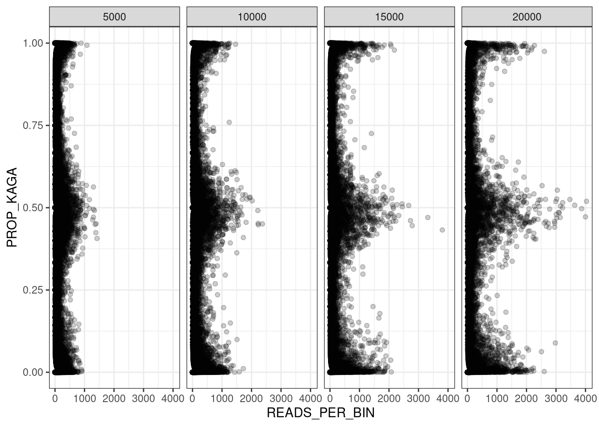
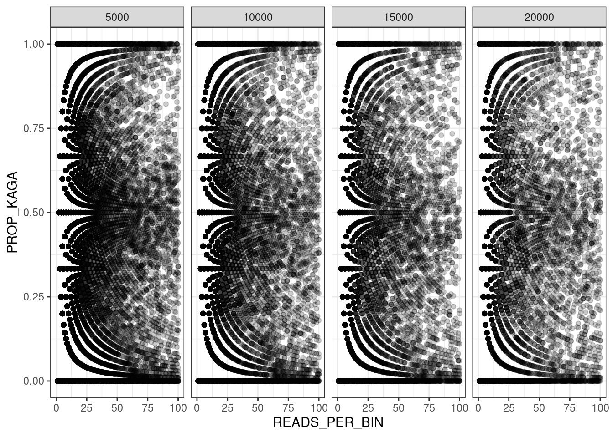
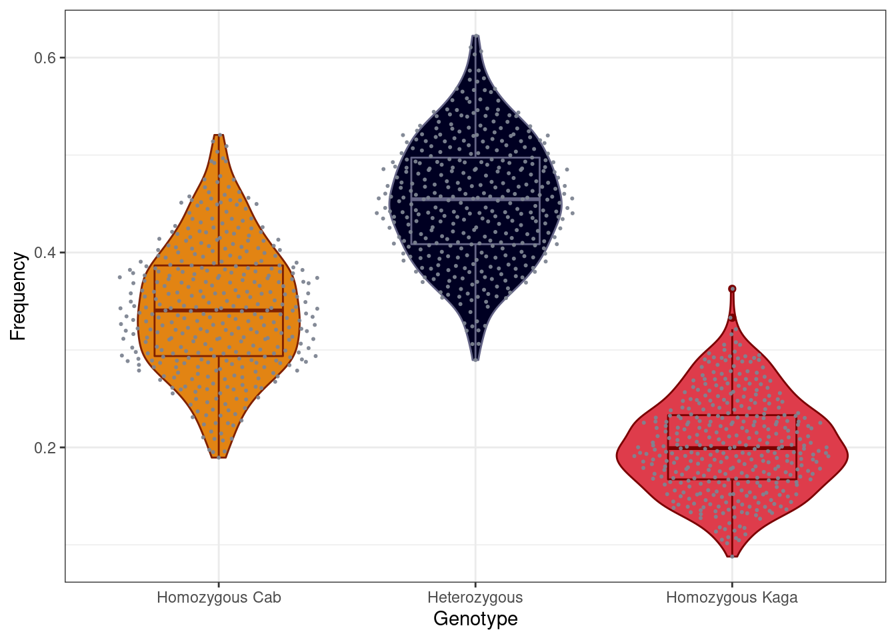

# F2 recombination blocks


```r
library(here)
source(here::here("book/source/03-F2_recombination.R"))
```

## Read in data


```r
in_dir = "/nfs/research/birney/users/ian/somites/recombination_blocks/20211027"

in_files = list.files(in_dir, pattern = "F2_", full.names = T)

##Read into list
data_list = purrr::map(in_files, function(FILE){
  out = readr::read_tsv(FILE,
                        col_types = "ciiidii")
})
##Set names as bin length
names(data_list) = basename(in_files) %>% 
  stringr::str_split("_", simplify = T) %>% 
  subset(select = 2) %>% 
  stringr::str_remove(".txt")
##Reorder
data_list = data_list[order(as.numeric(names(data_list)))]

counter = 0
df_list = purrr::map(data_list, function(data){
  counter <<- counter + 1
  # set bin length
  bin_length = as.numeric(names(data_list)[counter])
  # add bin start and end coordinates
  df = data %>% 
    dplyr::mutate(LANE = basename(sample) %>% 
                    stringr::str_remove(".txt") %>% 
                    as.numeric(.),
                  BIN_LENGTH = bin_length,
                  BIN_START = (bin - 1) * bin_length + 1,
                  BIN_END = bin * bin_length,
                  BIN_LENGTH_KB = BIN_LENGTH / 1e3,
                  READS_PER_BIN = mat + pat)
  return(df)
})
```

## Look at relationship between `ratio` and `state`

To determine which state is associated with which parental strain.

In the pipeline, we set *Cab* as F0_1 and *Kaga* as F0_2. 


```r
head(df_list$`5000`) %>% 
  DT::datatable(.)
```

```{=html}
<div id="htmlwidget-5f717d8995e3551bfb9b" style="width:100%;height:auto;" class="datatables html-widget"></div>
<script type="application/json" data-for="htmlwidget-5f717d8995e3551bfb9b">{"x":{"filter":"none","data":[["1","2","3","4","5","6"],["/hps/nobackup/birney/users/ian/somites/dpABs/batch_01/bwamem2/1.txt","/hps/nobackup/birney/users/ian/somites/dpABs/batch_01/bwamem2/1.txt","/hps/nobackup/birney/users/ian/somites/dpABs/batch_01/bwamem2/1.txt","/hps/nobackup/birney/users/ian/somites/dpABs/batch_01/bwamem2/1.txt","/hps/nobackup/birney/users/ian/somites/dpABs/batch_01/bwamem2/1.txt","/hps/nobackup/birney/users/ian/somites/dpABs/batch_01/bwamem2/1.txt"],[0,5,4,11,16,5],[3,1,2,6,30,3],[4,6,8,11,16,17],[0,0.833333333333333,0.666666666666667,0.647058823529412,0.347826086956522,0.625],[1,1,1,1,1,1],[1,1,1,1,1,1],[1,1,1,1,1,1],[5000,5000,5000,5000,5000,5000],[15001,25001,35001,50001,75001,80001],[20000,30000,40000,55000,80000,85000],[5,5,5,5,5,5],[3,6,6,17,46,8]],"container":"<table class=\"display\">\n  <thead>\n    <tr>\n      <th> <\/th>\n      <th>sample<\/th>\n      <th>mat<\/th>\n      <th>pat<\/th>\n      <th>bin<\/th>\n      <th>ratio<\/th>\n      <th>chr<\/th>\n      <th>state<\/th>\n      <th>LANE<\/th>\n      <th>BIN_LENGTH<\/th>\n      <th>BIN_START<\/th>\n      <th>BIN_END<\/th>\n      <th>BIN_LENGTH_KB<\/th>\n      <th>READS_PER_BIN<\/th>\n    <\/tr>\n  <\/thead>\n<\/table>","options":{"columnDefs":[{"className":"dt-right","targets":[2,3,4,5,6,7,8,9,10,11,12,13]},{"orderable":false,"targets":0}],"order":[],"autoWidth":false,"orderClasses":false}},"evals":[],"jsHooks":[]}</script>
```

`ratio = mat / (mat + pat)`, where `mat` = Cab and `pat` = Kaga.

Plot `ratio` against `state`


```r
df_list$`5000` %>%
  dplyr::mutate(state = factor(state, levels = 0:2)) %>% 
  dplyr::slice_sample(n = 1e6) %>% 
  ggplot() +
    geom_boxplot(aes(state, ratio)) +
    guides(colour = "none") +
    theme_bw()
##Save
ggsave(here::here("book/plots/20211027_ratio_v_state.png"),
       device = "png",
       width = 8,
       height = 5,
       units = "in",
       dpi = 400)
```


```r
knitr::include_graphics(here::here("book/plots/20211027_ratio_v_state.png"))
```


This shows that state `0` is associated with a *low* ratio of Cab to Kaga, and therefore a call of *Kaga*.
Vice versa for state `2` and *Cab*. 

## Recode state to put in correct order


```r
df_list = purrr::map(df_list, function(df){
  df = df %>% 
    dplyr::mutate(state = dplyr::recode(state,
                                        `0` = 2,
                                        `1` = 1,
                                        `2` = 0))
})
```


## Read counts per bin


```r
##How many bins in each data frame? 
purrr::map_int(df_list, nrow)
#>     5000    10000    15000    20000 
#> 34410781 20625067 14908601 11724535

##Plot
df_list %>% 
  dplyr::bind_rows() %>% 
  dplyr::slice_sample(n = 1e5) %>% 
  dplyr::mutate(BIN_LENGTH_KB = factor(BIN_LENGTH_KB, levels = unique(BIN_LENGTH_KB)[order(unique(BIN_LENGTH_KB))])) %>% 
  # Plot
  ggplot(aes(BIN_LENGTH_KB, log10(READS_PER_BIN), fill = BIN_LENGTH_KB)) +
    geom_boxplot() +
    theme_bw() +
    scale_fill_manual(values = c("#778DA9", "#415A77", "#1B263B", "#0D1B2A")) +
    guides(fill = "none")
#> Warning: Removed 88 rows containing non-finite values
#> (stat_boxplot).
```


## Read counts by proportion of Kaga


```r
df_list %>% 
  dplyr::bind_rows() %>% 
  dplyr::slice_sample(n = 1e5) %>% 
  dplyr::mutate(PROP_KAGA = pat / READS_PER_BIN ) %>% 
  # Plot
  ggplot(aes(READS_PER_BIN, PROP_KAGA)) +
    geom_point(alpha = 0.2) +
    theme_bw() +
    facet_grid(cols = vars(BIN_LENGTH)) +
##   scale_colour_manual(values = c("#778DA9", "#415A77", "#1B263B", "#0D1B2A")) +
    guides(fill = "none")
#> Warning: Removed 66 rows containing missing values
#> (geom_point).
```



```r

##Limit to bins with 0-100 reads
df_list %>% 
  dplyr::bind_rows() %>% 
  dplyr::slice_sample(n = 1e5) %>% 
  dplyr::mutate(PROP_KAGA = pat / READS_PER_BIN ) %>% 
  # Plot
  ggplot(aes(READS_PER_BIN, PROP_KAGA)) +
    geom_point(alpha = 0.2) +
    theme_bw() +
    facet_grid(cols = vars(BIN_LENGTH)) +
##   scale_colour_manual(values = c("#778DA9", "#415A77", "#1B263B", "#0D1B2A")) +
    guides(fill = "none") +
    xlim(0,100)
#> Warning: Removed 23596 rows containing missing values
#> (geom_point).
```




## Proportion of genome and sites called as a given state

### Proportion of *genome* covered by each state

#### Read in total medaka genome count


```r
##Get chromosome lengths
med_chr_lens = read.table(here::here("data",
                                     "Oryzias_latipes.ASM223467v1.dna.toplevel.fa_chr_counts.txt"),
                          col.names = c("chr", "end"))
##Add start
med_chr_lens$start = 1
##Reorder
med_chr_lens = med_chr_lens %>% 
  dplyr::select(chr, start, end) %>% 
  # remove MT
  dplyr::filter(chr != "MT")

##Total HdrR sequence length
total_hdrr_bases = sum(med_chr_lens$end)
```

#### Get total number of bases covered by each state


```r
##Take 5kb DF
df = df_list$`5000`

##Set states to loop over
states = 0:2
names(states) = states

##Run loop over each LANE

base_cov_df = df %>% 
  split(., f = .$LANE) %>% 
  purrr::map(., function(LANE){
    # convert to ranges object
    lane_ranges = GenomicRanges::makeGRangesFromDataFrame(LANE,
                                                          keep.extra.columns = T,
                                                          ignore.strand = T,
                                                          seqnames.field = "chr", 
                                                          start.field = "BIN_START",
                                                          end.field = "BIN_END")
    # get total bases covered by each state
    purrr::map_dfr(states, function(STATE){
      lane_ranges[lane_ranges$state == STATE] %>% 
        # merge contiguous ranges
        GenomicRanges::reduce(.) %>% 
        # get width of ranges
        width(.) %>% 
        # get total bases covered
        sum(.) %>% 
        # coerce into data frame
        data.frame("BASES_COVERED" = .)
      }, .id = "STATE") %>% 
        # add FREQ column
        dplyr::mutate(FREQ = BASES_COVERED / total_hdrr_bases) %>% 
        # add UNCLASSIFIED row
        tibble::add_row(STATE = "UNCLASSIFIED", 
                        BASES_COVERED = total_hdrr_bases - sum(.$BASES_COVERED),
                        FREQ = (total_hdrr_bases - sum(.$BASES_COVERED)) / total_hdrr_bases)
    }
  ) %>% 
  dplyr::bind_rows(.id = "LANE")
```

Plot


```r
##Plot
base_cov_df %>% 
  dplyr::mutate(STATE = factor(STATE, levels = c(0,1,2, "UNCLASSIFIED")),
                STATE_RECODE = dplyr::recode(STATE,
                                             `0` = "Homozygous Cab",
                                             `1` = "Heterozygous",
                                             `2` = "Homozygous Kaga",
                                             "UNCLASSIFIED" = "Unclassified")) %>% 
  # plot
  ggplot(aes(STATE_RECODE, FREQ, colour = STATE, fill = STATE)) +
    geom_violin() +
    geom_boxplot(width = .3) +
    ggbeeswarm::geom_quasirandom(color="#7D8491", size=0.4, alpha=0.9) +
    theme_bw() +
    scale_colour_manual(values = pal_hom_het_2_lines) +
    scale_fill_manual(values = pal_hom_het_2) +
    guides(colour = "none", fill = "none") +
    xlab("Genotype") +
    ylab("Proportion of reference bases covered")
```


#### By chromosome

Process.


```r
##Set states to loop over
states = 0:2
names(states) = states

##Run loop over each LANE

base_cov_df_chr = df %>% 
  split(., f = .$LANE) %>% 
    purrr::map(., function(LANE){
      # convert to ranges object
      lane_ranges = GenomicRanges::makeGRangesFromDataFrame(LANE,
                                                            keep.extra.columns = T,
                                                            ignore.strand = T,
                                                            seqnames.field = "chr", 
                                                            start.field = "BIN_START",
                                                            end.field = "BIN_END")
      # loop over each chromosome
      purrr::map(med_chr_lens$chr, function(CHR){
        # get total length of target chromosome
        target_chr_len = med_chr_lens$end[med_chr_lens$chr == CHR]
        # get total bases covered by each state per chromosome
        purrr::map_dfr(states, function(STATE){
          lane_ranges[lane_ranges$state == STATE & lane_ranges@seqnames == CHR] %>% 
            # merge contiguous ranges
            GenomicRanges::reduce(.) %>% 
            # get width of ranges
            width(.) %>% 
            # get total bases covered
            sum(.) %>% 
            # coerce into data frame
            data.frame("BASES_COVERED" = .)
          }, .id = "STATE") %>% 
            # add FREQ column
            dplyr::mutate(FREQ = BASES_COVERED / target_chr_len ) %>% 
            # add UNCLASSIFIED row
            tibble::add_row(STATE = "UNCLASSIFIED", 
                            BASES_COVERED = target_chr_len - sum(.$BASES_COVERED),
                            FREQ = (target_chr_len - sum(.$BASES_COVERED)) / target_chr_len)
      }) %>% 
        dplyr::bind_rows(.id = "CHR")
    }
  ) %>% 
  dplyr::bind_rows(.id = "LANE")
```


```r
saveRDS(base_cov_df_chr, here::here("data/20211027_base_cov_per_chr.rds"))
```


Plot

```r
##Plot
base_cov_df_chr %>% 
  dplyr::mutate(STATE = factor(STATE, levels = c(0,1,2, "UNCLASSIFIED")),
                STATE_RECODE = dplyr::recode(STATE,
                                             `0` = "Homozygous Cab",
                                             `1` = "Heterozygous",
                                             `2` = "Homozygous Kaga",
                                             "UNCLASSIFIED" = "Unclassified"),
                CHR = factor(CHR, levels = med_chr_lens$chr)) %>% 
  # plot
  ggplot(aes(STATE_RECODE, FREQ, colour = STATE, fill = STATE)) +
    geom_violin() +
    geom_boxplot(width = .1) +
    ggbeeswarm::geom_quasirandom(color="#7D8491", size=0.1, alpha=0.7) +
    theme_bw() +
    scale_colour_manual(values = pal_hom_het_2_lines) +
    scale_fill_manual(values = pal_hom_het_2) +
    guides(colour = "none", fill = "none") +
    xlab("Genotype") +
    ylab("Proportion of reference bases covered") +
    facet_wrap(~CHR, nrow = 4, ncol = 6) +
    theme(axis.text.x = element_text(angle = 45, hjust = 1))
```


### Proportion of *sites* covered by each state

#### Genome-wide


```r
df %>% 
  # get counts of sites per LANE and state
  dplyr::group_by(LANE, state) %>% 
  dplyr::count() %>% 
  # spread to one row per LANE
  tidyr::pivot_wider(id_cols = LANE, names_from = state, values_from = n) %>% 
  # calculate frequencies of states per LANE
  dplyr::mutate(TOTAL = sum(`0`, `1`, `2`),
                FREQ_0 = `0` / TOTAL,
                FREQ_1 = `1` / TOTAL,
                FREQ_2 = `2` / TOTAL) %>% 
  # gather
  tidyr::pivot_longer(cols = starts_with("FREQ_"),
                      names_to = "STATE",
                      names_prefix = "FREQ_",
                      values_to = "FREQ") %>% 
  # order STATE and recode with meaning
  dplyr::mutate(STATE = factor(STATE, levels = c(0,1,2)),
                STATE_RECODE = dplyr::recode(STATE,
                                      `0` = "Homozygous Cab",
                                      `1` = "Heterozygous",
                                      `2` = "Homozygous Kaga")) %>% 
  # plot
  ggplot(aes(STATE_RECODE, FREQ, colour = STATE, fill = STATE)) +
    geom_violin() +
    geom_boxplot(width = .5) +
    ggbeeswarm::geom_quasirandom(color="#7D8491", size=0.4, alpha=0.9) +
    theme_bw() +
    scale_colour_manual(values = pal_hom_het_2_lines) +
    scale_fill_manual(values = pal_hom_het_2) +
    guides(colour = "none", fill = "none") +
    xlab("Genotype") +
    ylab("Frequency")
```

<div class="figure">

<p class="caption">(\#fig:unnamed-chunk-16)Frequency based on number of sites</p>
</div>


```r
ggsave(here::here("plots/20211027_gt_freqs_sites.png"),
       device = "png",
       width = 10,
       height = 5.8,
       units = "in",
       dpi = 400)
```

#### Per chromosome


```r
df %>% 
  dplyr::mutate(state = factor(state, levels = 0:2)) %>% 
  # get counts of sites per LANE and state
  dplyr::group_by(LANE, chr, state) %>%
  dplyr::count(.drop = F) %>% 
  # spread to one row per LANE
  tidyr::pivot_wider(id_cols = c(LANE, chr), names_from = state, values_from = n) %>% 
  # replace NAs with 0 manually , because `.drop = F` in `count` above doesn't work 
  dplyr::mutate(dplyr::across(c(`0`, `1`, `2`),
                            ~tidyr::replace_na(.x, 0))) %>% 
  # calculate frequencies of states per LANE
  dplyr::mutate(TOTAL = sum(`0`, `1`, `2`, na.rm = T),
                FREQ_0 = `0` / TOTAL,
                FREQ_1 = `1` / TOTAL,
                FREQ_2 = `2` / TOTAL) %>% 
  # gather
  tidyr::pivot_longer(cols = starts_with("FREQ_"),
                      names_to = "STATE",
                      names_prefix = "FREQ_",
                      values_to = "FREQ") %>% 
  # order STATE and recode with meaning
  dplyr::mutate(STATE = factor(STATE, levels = c(0,1,2)),
                STATE_RECODE = dplyr::recode(STATE,
                                      `0` = "Homozygous Cab",
                                      `1` = "Heterozygous",
                                      `2` = "Homozygous Kaga")) %>% 
  # plot
  ggplot(aes(STATE_RECODE, FREQ, colour = STATE, fill = STATE)) +
    geom_violin() +
    geom_boxplot(width = .1) +
    ggbeeswarm::geom_quasirandom(color="#7D8491", size=0.1, alpha=0.7) +
    theme_bw() +
    scale_colour_manual(values = pal_hom_het_2_lines) +
    scale_fill_manual(values = pal_hom_het_2) +
    guides(colour = "none", fill = "none") +
    xlab("Genotype") +
    ylab("Frequency") +
    facet_wrap(~chr, nrow = 4, ncol = 6) +
    theme(axis.text.x = element_text(angle = 45, hjust = 1))
```

<div class="figure">

<p class="caption">(\#fig:unnamed-chunk-18)Frequency per-chromosome based on number of sites</p>
</div>

##Karyoplot

Make custom chromosome scaffold


```r
##Create custom genome 
med_genome = regioneR::toGRanges(med_chr_lens)
```

Convert data to list of block boundaries for each LANE


```r
bb_list = purrr::map(df_list, function(df){
  # loop over different bin lengths
  block_bounds_list = df %>% 
    # loop over LANE
    split(., f = .$LANE) %>% 
    purrr::map(., function(LANE){
      # loop over CHR
      LANE %>% 
        split(., f = .$chr) %>% 
        purrr::map(., function(CHR){
          # Get lengths of each contiguous state
          cont_len = rle(CHR$state)
          
          # Get cumulative sum of those lengths
          cum_blocks = cumsum(cont_len$lengths)
          
          # Get rows that correspond to block changes
          block_bounds = CHR[cum_blocks, ] %>% 
            # Add end of previous block
            dplyr::mutate(END_PREV = dplyr::lag(BIN_END)) %>% 
            # Replace the NA in the first row with `1`
            dplyr::mutate(END_PREV = tidyr::replace_na(END_PREV, 1)) %>% 
            # Add colour
            dplyr::mutate(COLOUR = dplyr::recode(state,
                                                 !!!pal_hom_het_2[-which(names(pal_hom_het_2) == "UNCLASSIFIED")])) 
          
        }) %>% 
            dplyr::bind_rows()
      
  })
})

```


Extract y cutoff points for each lane


```r
lc_list = purrr::map(bb_list, function(block_bounds_list){
  lane_cutoffs = cut(0:1, breaks = length(block_bounds_list), dig.lab = 7) %>% 
    levels(.) %>% 
    data.frame(lower = as.numeric( sub("\\((.+),.*", "\\1", .) ),
               upper = as.numeric( sub("[^,]*,([^]]*)\\]", "\\1", .) )) %>% 
    dplyr::arrange(dplyr::desc(lower))
  return(lane_cutoffs)
})
```

Plot karyoplots


```r
counter_A = 0
purrr::map(bb_list, function(block_bounds_list){
  counter_A <<- counter_A + 1
  # set file name
  file_name = paste("20211027_karyoplot_", names(bb_list)[counter_A], ".png", sep = "")
  file_out = here::here("book/plots", file_name)
  
  # Get lane cutoffs
  lane_cutoffs = lc_list[[counter_A]]
  
  png(file=file_out,
      width=13000,
      height=26000,
      units = "px",
      res = 300)
  
  # Plot ideogram
  kp = karyoploteR::plotKaryotype(med_genome, plot.type = 5)
  # Add data background
  #karyoploteR::kpDataBackground(kp, r0=0, r1 = 1, color = "white")
  
  # Add rectangles in loop
  counter_B = 0
  purrr::map(block_bounds_list, function(LANE){
    # Add to counter_B
    counter_B <<- counter_B + 1
    # Add rectangles
    karyoploteR::kpRect(kp,
                        chr = LANE$chr,
                        x0 = LANE$END_PREV,
                        x1 = LANE$BIN_END,
                        y0 = lane_cutoffs[counter_B, ] %>% 
                          dplyr::pull(lower),
                        y1 = lane_cutoffs[counter_B, ] %>% 
                          dplyr::pull(upper),
                        col = LANE$COLOUR,
                        border = NA)
    # Add axis label
    karyoploteR::kpAddLabels(kp, labels = unique(LANE$LANE),
                             r0 = lane_cutoffs[counter_B, ] %>% 
                               dplyr::pull(lower),
                             r1 = lane_cutoffs[counter_B, ] %>% 
                               dplyr::pull(upper),
                             cex = 0.5)
  })
  
  
  dev.off()  
})

```


```r
knitr::include_graphics(here::here("book/plots/20211027_karyoplot_5000.png"))
```

<div class="figure">

<p class="caption">(\#fig:unnamed-chunk-25)Bin length: 5 kb</p>
</div>

Don't show other bin lengths because they look the same.


```r
knitr::include_graphics(here::here("book/plots/20211027_karyoplot_10000.png"))
```


```r
knitr::include_graphics(here::here("book/plots/20211027_karyoplot_15000.png"))
```


```r
knitr::include_graphics(here::here("book/plots/20211027_karyoplot_20000.png"))
```

##Realised relationship matrix

## Process data


```r
# Process data
gt_mat_rc = df_list$`5000` %>% 
  # extract LANE names from sample name, and create site name by binding `chr` and `block`
  dplyr::mutate(LANE = basename(sample) %>% 
                  stringr::str_remove(".txt") %>% 
                  as.numeric(.),
                SITE = paste(chr, bin, sep = ":")) %>% 
## dplyr::filter(SITE %in% unique(SITE)[1:10]) %>% 
  dplyr::select(LANE, SITE, state) %>% 
  # recode 0,1,2 to -1,0,1
  dplyr::mutate(state = dplyr::recode(state,
                                      `0` = -1,
                                      `1` = 0,
                                      `2` = 1)) %>% 
  # pivot to put sites into columns
  tidyr::pivot_wider(id_cols = c(LANE, SITE),
                     names_from = SITE,
                     values_from = state) %>% 
  # remove LANE column
  dplyr::select(-LANE) %>% 
  # convert to matrix
  as.matrix(.)

#Compute realised relationship matrix
rrmat = sommer::A.mat(gt_mat_rc)

#Save object
saveRDS(rrmat, here::here("data/realised_relationship_matrix.rds"))
```

## Plot


```r
rrmat = readRDS(here::here("data/realised_relationship_matrix.rds"))

png(here::here("book/plots/20211027_rrm_heatmap.png"),
    width = 20,
    height = 20,
    units = "in",
    res = 400)

heat_cols = colorRampPalette(c("#9EC5AB", "#0D4045"))
heatmap(rrmat, symm = T, col = heat_cols(100))

dev.off()
```


```r
knitr::include_graphics(here::here("book/plots/20211027_rrm_heatmap.png"))
```


