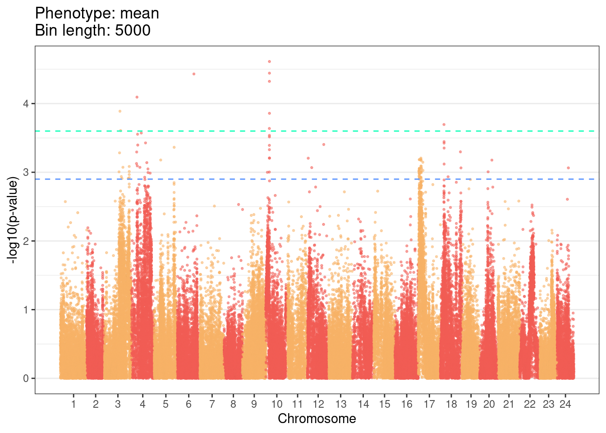
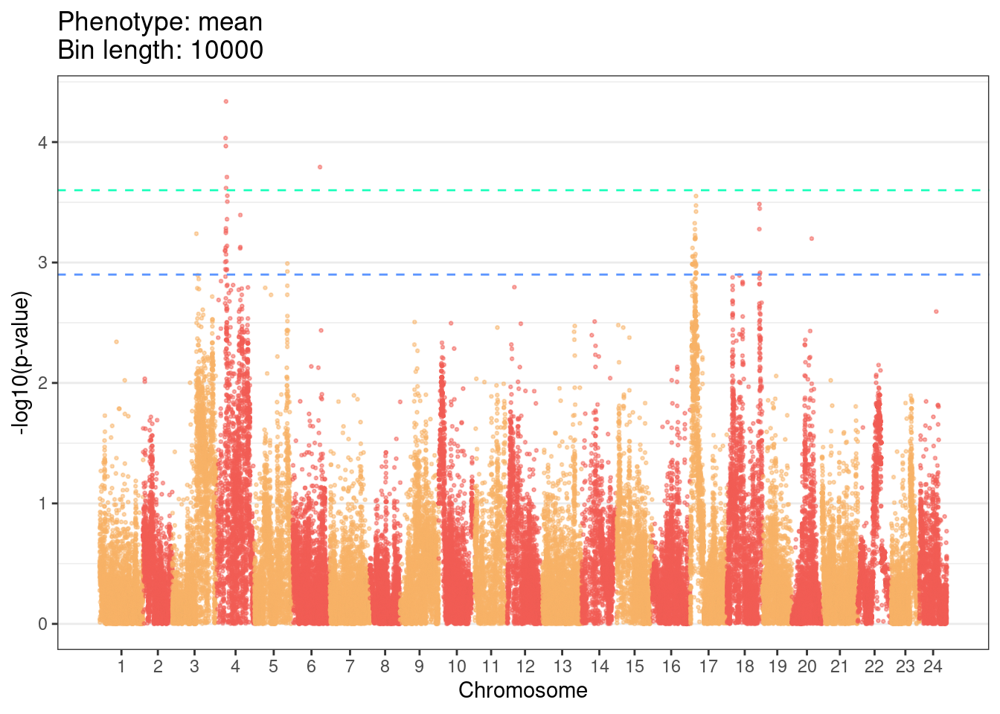
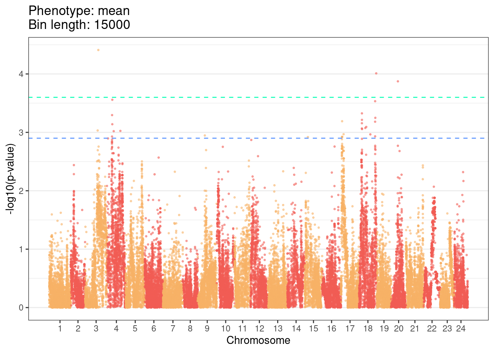
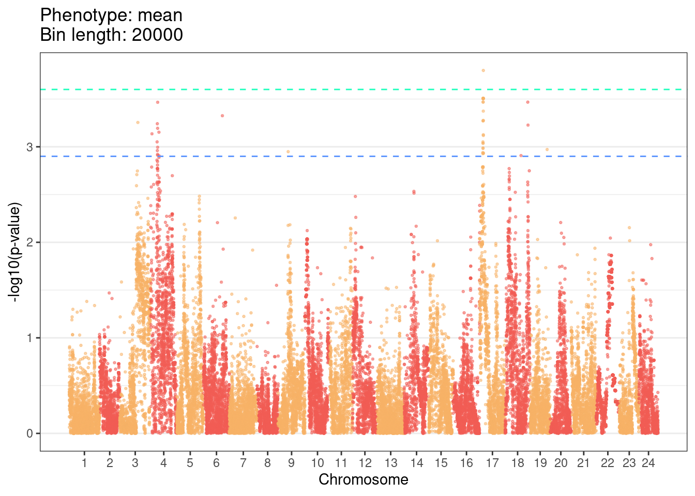
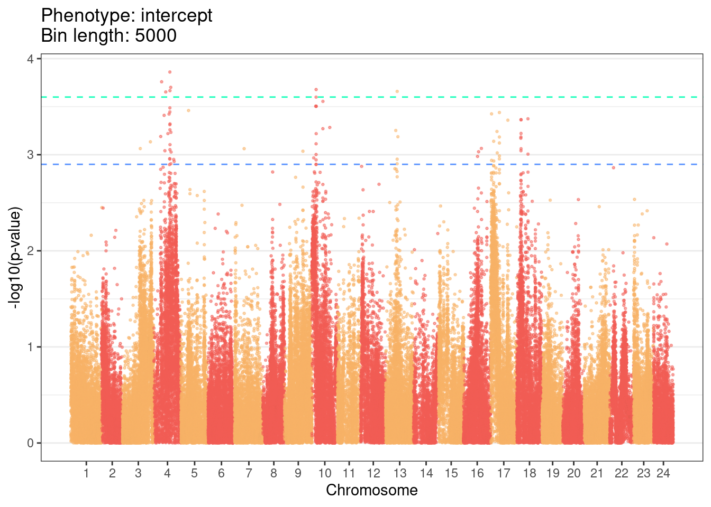
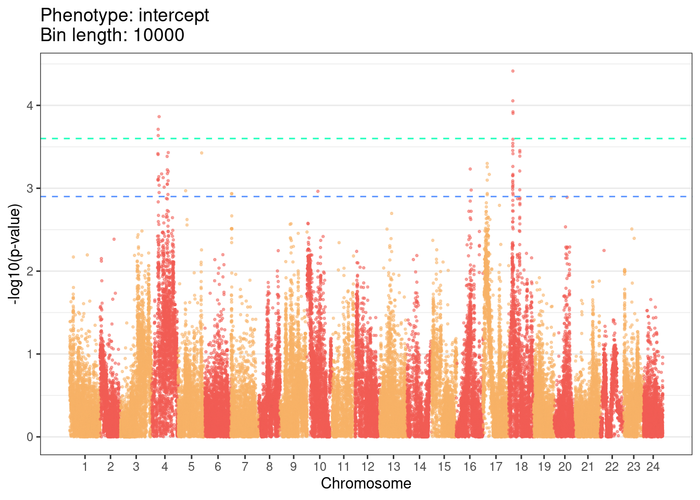
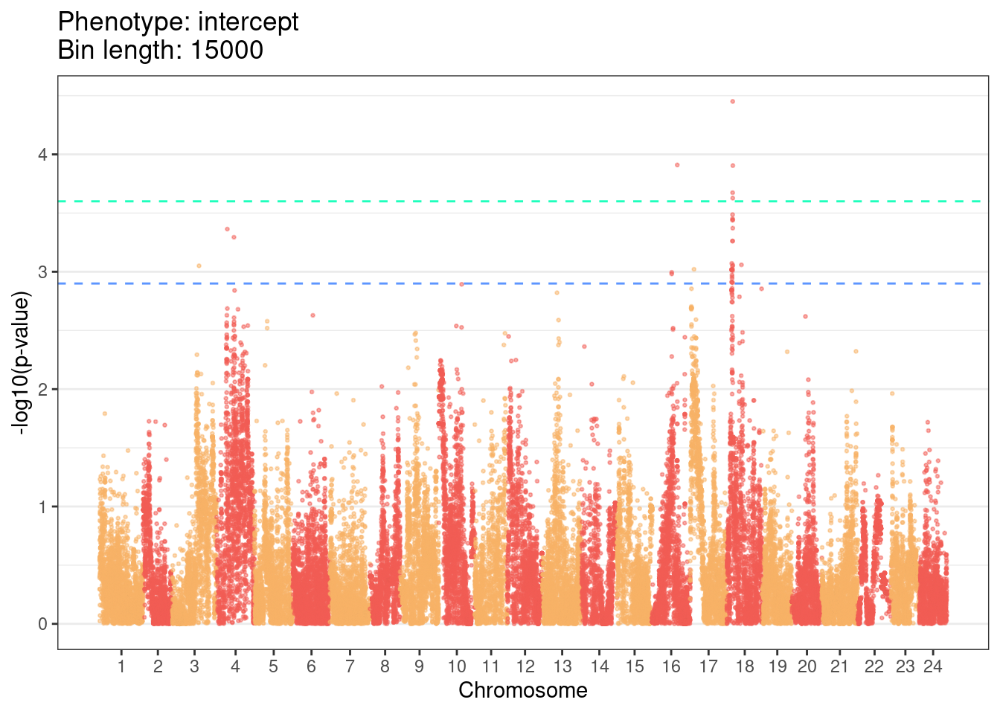
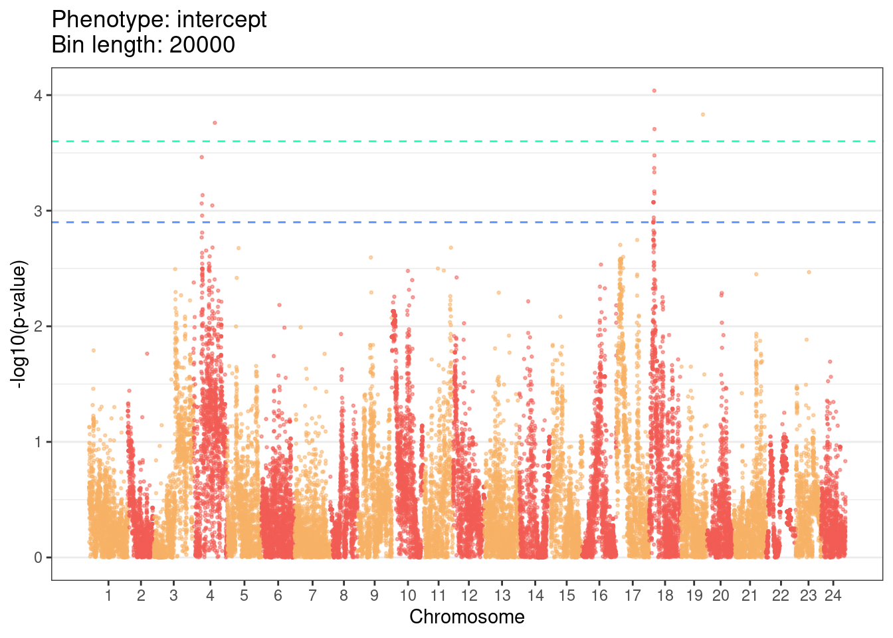

# GWLS results


```r
library(here)
source(here::here("book/source/04-Association_testing.R"))
```

## Phenotype data

First 400 phenotype data: <https://github.com/brettellebi/somites/tree/master/data/20210917_First400_F2_DF.xlsx>.

>I also attach here the DataFrame of the phenotyping of the first 400 F2s (First400_F2_DF.xlsx)...

>Of interest for us for the association testing are the:
 intercept period -> intercept in the table
 mean period -> mean in the table
 
## Snakemake rules

Snakemake rules for running the GWAS over these phenotypes: <https://github.com/brettellebi/somites/blob/master/workflow/rules/07_assocation_testing.smk>

## Results

### Read in files


```r
target_phenos = c("mean", "intercept")
names(target_phenos) = target_phenos
bin_lengths = c(5000, 10000, 15000, 20000)
names(bin_lengths) = bin_lengths
results_dir = "/nfs/research/birney/users/ian/somites/association_testing/20211104_true/results"

gwas_true = purrr::map(target_phenos, function(PHENO){
  purrr::map(bin_lengths, function(BIN_LENGTH){
    readRDS(file.path(results_dir, PHENO, paste(BIN_LENGTH, ".rds", sep = "")))
  })
})
```

### Manhattans

Process data

```r
plot_dat = purrr::map(seq_along(gwas_true), function(COUNTER_1){
  bin_list = purrr::map(seq_along(gwas_true[[COUNTER_1]]), function(COUNTER_2){
    BIN_LENGTH = names(gwas_true[[COUNTER_1]])[COUNTER_2] %>% 
      as.numeric()
    out = clean_gwas_res(gwas_true[[COUNTER_1]][[COUNTER_2]],
                         bin_length = BIN_LENGTH,
                         chr_lens = med_chr_lens)
    
    return(out)
  })
  names(bin_list) = names(gwas_true[[COUNTER_1]])
  
  return(bin_list)
})
names(plot_dat) = names(gwas_true)
```

Plot

```r
plot_dir = here::here("book/plots/20211104_gwls_results")
# Plot
lapply(seq_along(plot_dat), function(COUNTER_PHENO){
  lapply(seq_along(plot_dat[[COUNTER_PHENO]]), function(COUNTER_BINL){
    # Get pheno
    PHENO = names(plot_dat)[COUNTER_PHENO]
    # Get bin length
    BIN_LENGTH = names(plot_dat[[COUNTER_PHENO]])[COUNTER_BINL] %>% 
      as.numeric()
    # Plot
    out = plot_man(plot_dat[[COUNTER_PHENO]][[COUNTER_BINL]],
             phenotype = PHENO,
             bin_length = BIN_LENGTH,
             gwas_pal = gwas_pal[2:3],
             med_chr_lens = med_chr_lens)
    
    #ggsave(out,
    #       file.path(plot_dir, paste(PHENO, "_", BIN_LENGTH, ".png")),
    #       device = "png",
    #       width = 9.6,
    #       height = 6,
    #       units = "in",
    #       dpi = 400)
  })
})
#> [[1]]
#> [[1]][[1]]
```



```
#> 
#> [[1]][[2]]
```



```
#> 
#> [[1]][[3]]
```



```
#> 
#> [[1]][[4]]
```



```
#> 
#> 
#> [[2]]
#> [[2]][[1]]
```



```
#> 
#> [[2]][[2]]
```



```
#> 
#> [[2]][[3]]
```



```
#> 
#> [[2]][[4]]
```




