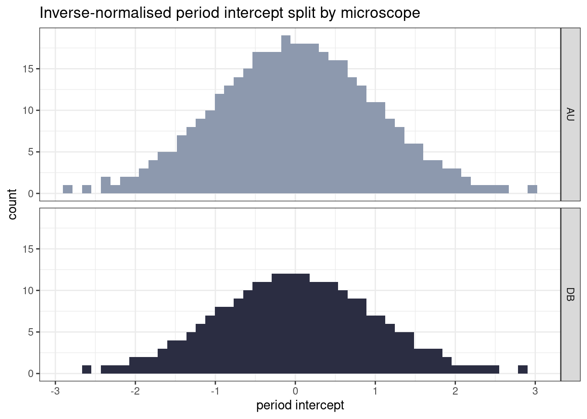
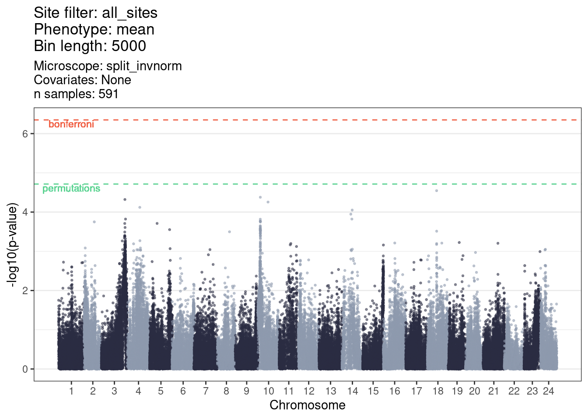

# Inverse-normalize by microscope

## Run GWAS


```r
library(tidyverse)
library(GridLMM)
library(KRLS)

GENO_FILE = "/hps/nobackup/birney/users/ian/somites/association_testing/20220321/all_sites/inputs/5000.rds"
PHENO_FILE = here::here("data/20220321_phenotypes.xlsx") # True phenotypes
GWLS_SOURCE_FILE = here::here("workflow/scripts/run_gwas_source.R")
MANHAT_SOURCE_FILE = here::here("workflow/scripts/get_manhattan_source.R")
BIN_LENGTH = 5000
TARGET_PHENO = c("mean", "intercept")
MICROSCOPE = "split_invnorm"
OUT_PHENOS = here::here("data/20220310_invnorm_phenos.csv")
PLOT_DIR = here::here("book/plots/20220321/microscope_test")
ALPHA = 0.05

# Get GWAS functions

source(GWLS_SOURCE_FILE)
source(MANHAT_SOURCE_FILE)
```


```r
# Load genotypes and positions
in_list = readRDS(GENO_FILE)
```


```r
# Read in phenotypes

## Read in file and wrangle
phenos = readxl::read_xlsx(PHENO_FILE) %>%
    # adjust sample names
    dplyr::mutate(SAMPLE = fish %>% stringr::str_remove("KC") %>% 
                    as.numeric()) %>%
    # select key columns
    dplyr::select(SAMPLE, all_of(TARGET_PHENO), Microscope) %>%
    # ensure that the phenotype column is numeric
    dplyr::mutate(dplyr::across(all_of(TARGET_PHENO),
                                ~ as.numeric(.x)))

## Split into two DFs by microscope and inverse-normalise
phenos_au = phenos %>% 
  dplyr::filter(Microscope == "AU") %>% 
  dplyr::mutate(dplyr::across(dplyr::all_of(TARGET_PHENO),
                              ~my.invnorm(.)))

phenos_db = phenos %>% 
  dplyr::filter(Microscope == "DB") %>% 
  dplyr::mutate(dplyr::across(dplyr::all_of(TARGET_PHENO),
                              ~my.invnorm(.)))

## Combine
phenos = dplyr::bind_rows(phenos_au,
                          phenos_db) %>% 
  dplyr::arrange(SAMPLE) %>% 
  dplyr::mutate(SAMPLE = SAMPLE %>% 
                  as.character())

## Write to file
readr::write_csv(phenos, OUT_PHENOS)

# Plot
micr_pal = c("#8D99AE", "#2b2d42")

pheno_hist = phenos %>% 
  # remove NAs in `Microscope` column
  dplyr::filter(!is.na(Microscope)) %>% 
  ggplot() +
    geom_histogram(aes(intercept, fill = Microscope),
                   bins = 50) +
    scale_fill_manual(values = micr_pal) +
    facet_grid(rows = vars(Microscope)) +
    xlab("period intercept") +
    theme_bw() +
    ggtitle("Inverse-normalised period intercept split by microscope") +
    guides(fill = "none")

pheno_hist
```



```r

ggsave(file.path(PLOT_DIR, paste(MICROSCOPE, "_intercept_hist.png", sep = "")),
       pheno_hist,
       device = "png",
       width = 9.6,
       height = 6,
       units = "in",
       dpi = 400)
```

### Prepare input


```r

## Filter and order phenotypes
in_list[["phenotypes"]] = phenos %>%
    # filter phenotypes for those with genotypes
    dplyr::filter(SAMPLE %in% in_list[["sample_order"]]) %>%
    # join to `sample_order` to ensure phenotypes are in the correct order   
    dplyr::left_join(tibble::tibble(SAMPLE = in_list[["sample_order"]]),
                     .,
                     by = "SAMPLE") %>%
    # remove NAs (created by the samples that have genotypes but not phenotypes)
    tidyr::drop_na() %>%
    # the GridLMM code doesn't work with tibbles
    as.data.frame()

## Filter genotypes for those that have phenotypes
in_list[["genotypes"]] = in_list[["genotypes"]] %>%
    dplyr::slice(in_list[["sample_order"]] %in% in_list[["phenotypes"]]$SAMPLE %>% 
                   which())

## Filter sample_order for those that have phenotypes
in_list[["sample_order"]] = in_list[["phenotypes"]]$SAMPLE

## Get number of samples
N_SAMPLES = in_list[["sample_order"]] %>% 
  length()
```


### Run 

```r
# Run GWAS
out = run_gwas(d = in_list[["genotypes"]],
               m = in_list[["positions"]],
               p = in_list[["phenotypes"]]
              )

saveRDS(out, paste("/hps/nobackup/birney/users/ian/somites/microscope_test/gwas_results/", MICROSCOPE, ".rds", sep = ""))
```


```r
out = readRDS(paste("/hps/nobackup/birney/users/ian/somites/microscope_test/gwas_results/", MICROSCOPE, ".rds", sep = ""))
```

## Run permutations

### Permute phenos


```r
seeds = 1:10

counter = 0
perm_phenos = purrr::map(seeds, function(SEED){
  counter <<- counter + 1
  # set seed
  set.seed(seeds[counter])
  # randomise
  phenos = phenos %>% 
      # randomise phenotype
      dplyr::mutate(dplyr::across(all_of(TARGET_PHENO),
                                  ~ sample(.x)))
})
```

### Run GWLS


```r
perm_out = purrr::map(perm_phenos, function(PERM_PHENO){
  ## Read in file and wrangle
  phenos = PERM_PHENO
  
  ## Filter and order phenotypes
  in_list[["phenotypes"]] = phenos %>%
      # filter phenotypes for those with genotypes
      dplyr::filter(SAMPLE %in% in_list[["sample_order"]]) %>%
      # join to `sample_order` to ensure phenotypes are in the correct order   
      dplyr::left_join(tibble::tibble(SAMPLE = in_list[["sample_order"]]),
                       .,
                       by = "SAMPLE") %>%
      # remove NAs (created by the samples that have genotypes but not phenotypes)
      tidyr::drop_na() %>%
      # the GridLMM code doesn't work with tibbles
      as.data.frame()
  
  ## Filter genotypes for those that have phenotypes
  in_list[["genotypes"]] = in_list[["genotypes"]] %>%
      dplyr::slice(in_list[["sample_order"]] %in% in_list[["phenotypes"]]$SAMPLE %>% 
                     which())
  
  ## Filter sample_order for those that have phenotypes
  in_list[["sample_order"]] = in_list[["phenotypes"]]$SAMPLE
              
  # Run GWAS
  
  out = run_gwas(d = in_list[["genotypes"]],
                 m = in_list[["positions"]],
                 p = in_list[["phenotypes"]]
                )
  
  return(out)
})

names(perm_out) = seeds

saveRDS(perm_out, paste("/hps/nobackup/birney/users/ian/somites/microscope_test/perms/", MICROSCOPE, ".rds", sep = ""))
```


```r
perm_out = readRDS(paste("/hps/nobackup/birney/users/ian/somites/microscope_test/perms/", MICROSCOPE, ".rds", sep = ""))
```

### Get minimum


```r
perm_df = purrr::map_dfr(perm_out, function(PERM){
  OUT = tibble::tibble(MIN_P = PERM$results$p_value_REML %>%
                         min(., na.rm = T)
  )
}, .id = "SEED")

# Get minimum
SIG_LEVEL = min(perm_df$MIN_P)

# Get bonferroni correction
SIG_BONF = ALPHA / nrow(out$results)
```

## Generate Manhattan plot


```r
out_clean = clean_gwas_res(out,
                           bin_length = BIN_LENGTH,
                           chr_lens = med_chr_lens)


# Get bonferroni significance level
BONFERRONI = ALPHA / nrow(out_clean)

# Plot
out_plot = plot_man(out_clean,
                    site_filter = "all_sites",
                    phenotype = TARGET_PHENO,
                    bin_length = BIN_LENGTH, 
                    gwas_pal = intercept_pal,
                    med_chr_lens = med_chr_lens,
                    sig_level = SIG_LEVEL,
                    bonferroni = BONFERRONI) +
                 #ylim(0,7) + 
                 labs(subtitle = paste("Microscope: ", MICROSCOPE, "\nCovariates: None\nn samples: ", N_SAMPLES, sep = ""))

out_plot
```




```r
ggsave(file.path(PLOT_DIR, paste(MICROSCOPE, "_manhattan.png", sep = "")),
       out_plot,
       device = "png",
       width = 9.6,
       height = 6,
       units = "in",
       dpi = 400)
```
